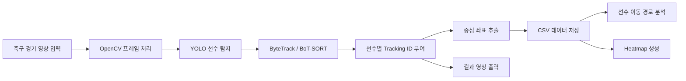

# 축구 경기 영상 선수 추적 및 움직임 분석 프로젝트 제안서

## 1. 프로젝트 개요

### 1.1. 기본 정보

- **프로젝트 제목:** 축구 경기 영상 선수 추적 및 움직임 분석
- **작성일자:** 2026-10-05
- **학번 / 이름:** 20242406 / 이진우

---

## 2. 서론 및 배경

### 2.1. 배경

- **문제 정의:**  
  축구 경기 영상에는 여러 명의 선수가 동시에 움직이기 때문에 사람이 직접 각 선수의 위치와 움직임을 계속 기록하고 분석하기 어렵다.  
  본 프로젝트에서는 컴퓨터 비전 기술을 이용해 경기 영상 속 선수를 자동으로 탐지하고 추적한 뒤, 선수의 위치 데이터를 저장하여 이동 경로와 활동 영역을 시각화하고자 한다.

- **제안 배경:**  
  최근 스포츠 분야에서도 영상 데이터를 이용한 선수 위치 추적과 경기 분석 기술이 많이 활용되고 있다.  
  개인 프로젝트 범위를 고려하여 경기 전체를 분석하기보다는 30초~1분 정도의 짧은 경기 장면을 대상으로 선수 탐지와 추적 기능을 구현하고, 그 결과를 데이터 분석으로 연결하는 것을 목표로 한다.

### 2.2. 기여점

- **참고 프로젝트 주제:**  
  YOLO 기반 축구 경기 객체 탐지 및 선수 추적 프로젝트

## 기존 프로젝트와의 차별성

## 2.3. 참고 프로젝트

Football Analysis Project는 YOLO와 ByteTrack을 이용해 선수·심판·공을 탐지하고 추적하며, 팀 구분과 속도·이동거리 계산 등을 수행한다. 본 프로젝트는 이를 참고하여 **선수별 이동 경로와 활동 영역을 분석하는 기능**에 집중할 예정이다.

## 2.4. 주요 차이점

| 구분 | 참고 프로젝트의 기본 구성 | 본 프로젝트의 계획 |
|---|---|---|
| 주요 분석 | 선수·공 추적, 팀 구분, 속도·거리 계산 | 선수별 이동 경로와 히트맵 분석 |
| 결과 제공 | 영상 위에 분석 정보 표시 | 분석 영상, 위치 CSV, 선수별 그래프 제공 |
| 분석 대상 선택 | 전체 선수의 정보 표시 | 추적 ID와 시간 구간을 선택해 분석 |
| 추적 평가 | 기본 출력에 별도 평가 없음 | ID 변경과 누락 구간 확인, 추적 방식 비교 |

## 2.5. 발전시킬 부분

1. **선수별 분석 기능**  
   YOLO11s로 선수를 탐지하고 위치를 CSV로 저장한 뒤, 선택한 선수의 이동 경로와 히트맵을 생성할 예정이다. 추적 ID는 실제 등번호와 구분한다.

2. **영상에 맞는 좌표 분석**  
   영상의 FPS를 자동으로 읽고 경기장 기준점을 영상별로 설정할 예정이다. 초기에는 고정 카메라 장면을 사용하며, 좌표 보정이 안 된 히트맵은 ‘영상 좌표 기준’으로 표시한다.

3. **추적 안정성 비교**  
   같은 영상과 탐지 모델에서 ByteTrack과 BoT-SORT를 비교하고, ID 변경·누락 횟수와 처리 속도를 확인할 예정이다. 분석 결과에도 누락 구간을 함께 표시한다.

히트맵과 좌표 보정 자체는 기존에도 있는 기술이다. 본 프로젝트에서는 이를 **선수별 조회와 추적 품질 확인 기능으로 연결하는 것**을 차별점으로 삼고자 한다. 개선 효과는 구현 후 실험을 통해 확인할 예정이다.


---

## 3. 상세 내용

### 3.1. 개발 목표 및 접근법

- **정량적 목표**
  - 30초~1분 길이의 축구 경기 영상 입력
  - 영상 내 여러 명의 선수를 자동 탐지
  - 탐지된 선수에게 Tracking ID 부여
  - 프레임별 선수 중심 좌표 저장
  - 선수별 이동 경로 및 히트맵 생성
  - 최소 3~5개의 경기 영상에서 동작 확인

- **정성적 목표**
  - 선수 움직임을 눈으로 확인할 수 있는 결과 영상 생성
  - 컴퓨터 비전 결과를 단순 Bounding Box 출력에 그치지 않고 데이터 분석으로 연결
  - 프로젝트 구조와 코드를 GitHub에서 쉽게 확인할 수 있도록 정리

- **핵심 알고리즘 및 접근법**
  - **YOLO:** 영상 프레임에서 사람 객체 탐지
  - **ByteTrack 또는 BoT-SORT:** 탐지된 선수의 ID를 프레임 간 유지
  - **OpenCV:** 영상 입력, 프레임 처리, Bounding Box 및 ID 출력
  - **Pandas / NumPy:** 선수 위치 데이터 저장 및 계산
  - **Matplotlib:** 이동 경로 및 Heatmap 시각화
  - **K-Means / HSV 분석(선택):** 유니폼 색상을 이용한 팀 구분

### 3.2. 시스템 아키텍처



- **파이프라인 설명**
  1. MP4 형식의 축구 경기 영상을 입력한다.
  2. OpenCV를 이용하여 영상을 프레임 단위로 읽는다.
  3. YOLO를 이용하여 각 프레임에서 선수를 탐지한다.
  4. Tracking 알고리즘을 적용하여 선수별 ID를 부여한다.
  5. Bounding Box의 중심 좌표 `(x, y)`를 계산한다.
  6. 프레임 번호, 선수 ID, 좌표 정보를 CSV 파일에 저장한다.
  7. 저장된 데이터를 이용하여 이동 경로와 Heatmap을 생성한다.
  8. Bounding Box와 Tracking ID가 표시된 결과 영상을 저장한다.

### 3.3. 입출력 인터페이스

- **입력 데이터 형태**
  - MP4 형식의 RGB 축구 경기 영상
  - 권장 해상도: 1280×720 또는 1920×1080
  - 영상 길이: 약 30초~1분
  - FPS: 약 25~30 FPS
  - 초기에는 화면 전환이 적은 연속된 경기 장면 사용

- **최종 출력 형태**
  1. 선수 Bounding Box와 Tracking ID가 표시된 결과 영상
  2. 선수 위치 데이터 CSV

```text
frame, player_id, x, y
1, 1, 432, 281
1, 2, 620, 315
2, 1, 437, 283
2, 2, 616, 312
```

  3. 특정 선수의 이동 경로 이미지
  4. 선수별 활동 영역 Heatmap
  5. 추후 구현 시 팀 정보가 포함된 Tracking 결과

---

## 4. 개발 환경

### 4.1. 데이터셋

- **데이터셋 이름:** SoccerNet Tracking 또는 공개 축구 경기 영상
- **데이터셋 출처:** SoccerNet 및 공개적으로 활용 가능한 축구 경기 영상 자료
- **데이터 규모:**
  - 초기 사용 영상: 약 3~5개
  - 영상당 길이: 약 30초~1분
  - 전체 영상 길이: 약 3~5분
  - 30 FPS 기준 약 4,500~9,000 프레임 예상
  - 예상 용량: 약 100MB~500MB

- **데이터 특징**
  - RGB 축구 경기 영상
  - 여러 명의 선수가 한 프레임에 동시에 등장
  - 선수 간 겹침이 자주 발생
  - 카메라 이동 및 확대/축소가 존재
  - 멀리 있는 선수는 객체 크기가 작음
  - 하이라이트 영상의 경우 장면 전환이나 리플레이가 포함될 수 있음
  - 초기에는 사전학습 YOLO 모델을 사용하므로 직접 라벨링한 학습 데이터는 사용하지 않음
  - 추후 Fine-Tuning 시 `Player`, `Referee`, `Ball` 클래스로 확장 가능

### 4.2. 실행 환경

- **개발 언어:** Python 3.10이상
- **개발 도구:** VSCode 
- **가상환경:** Conda 사용 예정
- **딥러닝 프레임워크:** PyTorch
- **주요 라이브러리**
  - YOLO11s
  - OpenCV
  - PyTorch
  - NumPy
  - Pandas
  - Matplotlib
  - scikit-learn

- **연산 환경**
  - CPU만으로도 실행 가능
  - 영상 처리 속도를 위해 NVIDIA GPU 사용 권장
  - 권장 VRAM: 약 4~6GB 이상
  - Fine-Tuning 진행 시 더 높은 VRAM 환경 또는 Kaggle/Colab GPU 사용 고려

---

## 5. 수행 계획

### 5.1. 개발 일정

| 기간 | 수행 내용 |
|---|---|
| **6~7주차** | 프로젝트 주제 확정, 참고 프로젝트 분석, 축구 영상 데이터 확보, OpenCV 영상 처리 및 YOLO 기본 코드 실행 |
| **8~9주차** | YOLO를 이용한 선수 탐지 구현, 영상별 탐지 결과 확인 |
| **9~10주차** | ByteTrack 또는 BoT-SORT를 적용하여 선수 Tracking 기능 구현 |
| **10~11주차** | 선수별 중심 좌표 추출 및 CSV 데이터 저장 |
| **11~12주차** | 선수 이동 경로 및 Heatmap 시각화 구현 |
| **12~13주차** | 여러 영상에서 테스트, Tracking ID 변경 및 탐지 오류 확인·보완 |
| **13~14주차** | 최종 결과 정리, GitHub README 및 프로젝트 보고서 작성, 발표 자료 제작 |

### 예상되는 문제 및 대응 방법

- **Tracking ID가 바뀌는 문제**
  - 선수끼리 겹치거나 화면 밖으로 나갔다 들어올 경우 발생할 수 있음
  - 짧고 연속된 경기 장면을 먼저 사용하고 Tracking 파라미터를 조정

- **카메라 이동 및 화면 전환**
  - 하이라이트 영상의 리플레이나 클로즈업으로 Tracking이 끊길 수 있음
  - 초기에는 장면 전환이 적은 구간만 사용

- **선수와 심판 구분**
  - 사전학습 모델에서는 모두 `person`으로 탐지될 수 있음
  - 필요 시 유니폼 색상 정보를 이용하여 구분 기능 추가

- **멀리 있는 선수 탐지 실패**
  - 작은 객체는 YOLO가 놓칠 수 있음
  - 입력 해상도와 모델 크기를 조절하여 비교

- **팀 구분 오류**
  - 유니폼 색상, 조명, 그림자에 따라 분류 오류 가능
  - HSV 색상 공간 또는 K-Means를 이용한 상체 영역 분석 적용

- **공 탐지**
  - 공은 작고 빠르기 때문에 초기 프로젝트 범위에서는 제외
  - 선수 Tracking이 안정적으로 구현된 이후 확장 기능으로 고려

---

## 6. 참고 문헌

- **오픈소스 저장소**
  - Football Analysis Project  
    https://github.com/abdullahtarek/football_analysis
  - Ultralytics YOLO  
    https://github.com/ultralytics/ultralytics

- **데이터셋**
  - SoccerNet  
    https://www.soccer-net.org/

- **기타 참고 자료**
  - OpenCV Documentation
  - Ultralytics YOLO Documentation
  - PyTorch Documentation

---

## 최종 목표 요약

```text
축구 경기 영상 입력
        ↓
YOLO 선수 탐지
        ↓
Player Tracking
        ↓
선수별 ID 및 위치 좌표 추출
        ↓
CSV 저장
        ↓
이동 경로 / Heatmap 분석
        ↓
Tracking 결과 영상 출력
```

본 프로젝트는 축구 경기 영상 전체를 정밀 분석하는 시스템보다는 개인 프로젝트 규모에 맞춰 **선수 탐지와 Tracking, 위치 데이터 분석을 안정적으로 구현하는 것**을 우선 목표로 한다.

